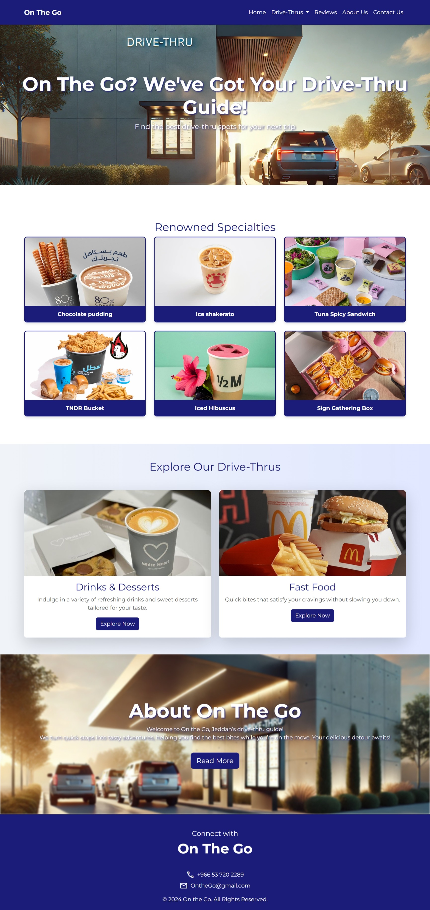
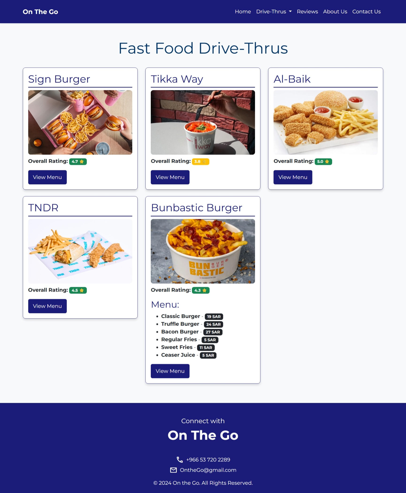
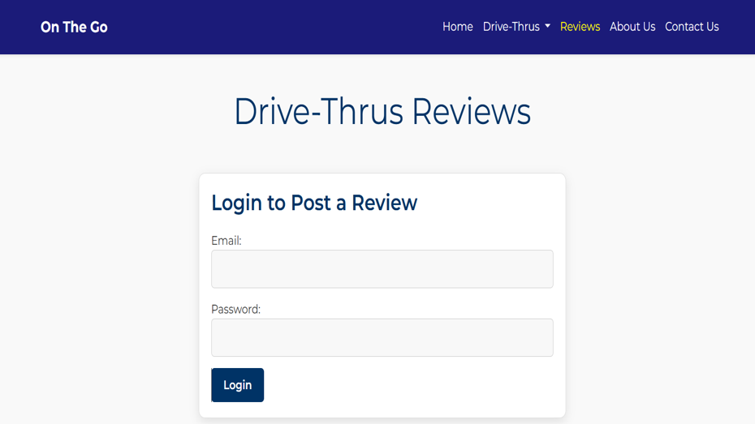
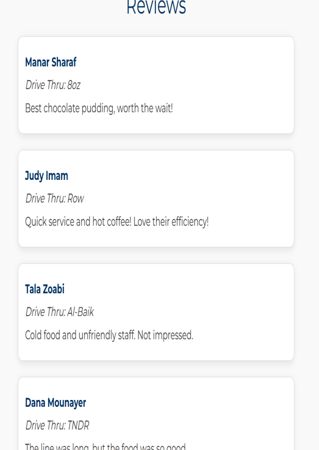
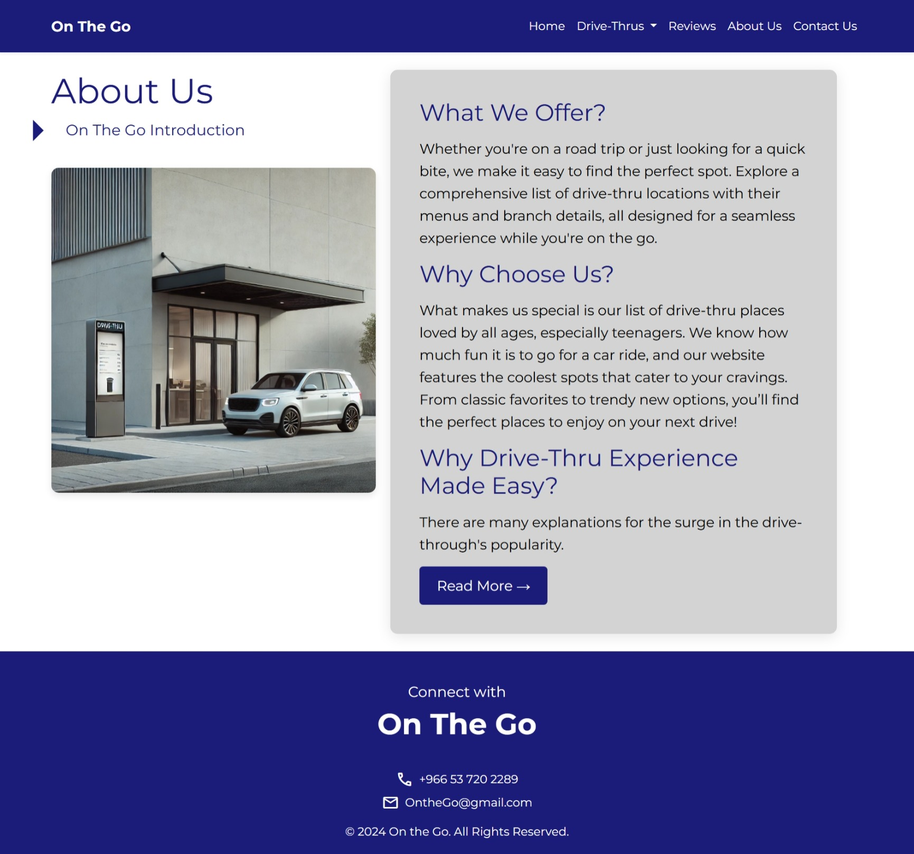
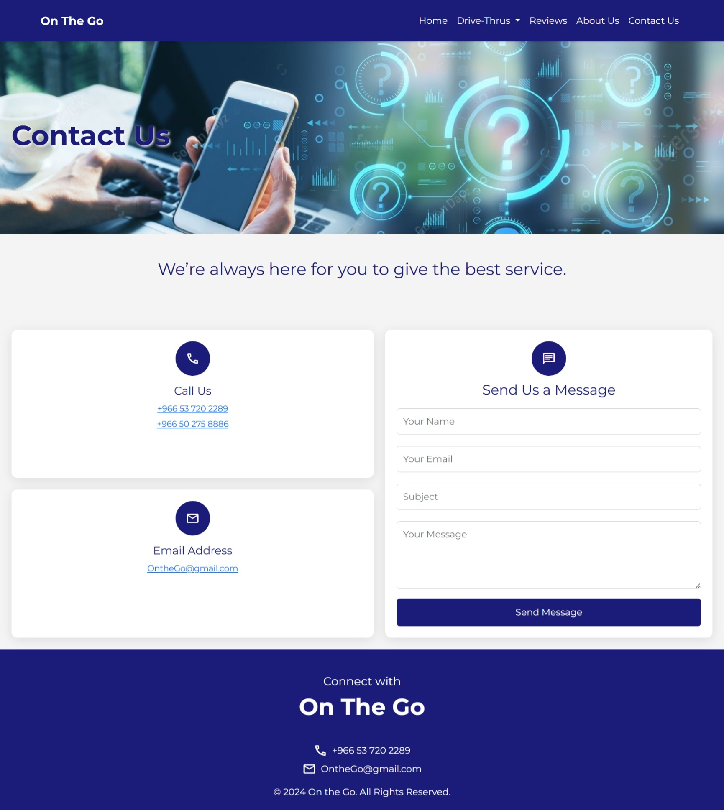

# On the Go 🚗🍔

A full-stack web development project designed to help users discover drive-thru food, drinks, and dessert options through an interactive website with user accounts, reviews, and location-based restaurant information.

## Project Overview

**On the Go** is a drive-thru discovery and review website developed as a Web Development course project.

The platform organizes drive-thru options into food and drinks/desserts categories while allowing users to explore different locations and interact with the website through a review system.

The project combines front-end web development with PHP and MySQL-based backend functionality.

---

## Key Features

- Drive-thru food discovery
- Drinks and dessert discovery
- Individual drive-thru information
- User registration and login
- User session management
- Review submission
- Review editing and deletion
- Admin review management
- Contact form with input validation
- Responsive interface using Bootstrap
- Database-backed user and review functionality

---

## Website Pages

The website includes several main sections:

### Home
Introduces the On the Go platform and provides navigation to the main website features.

### Food
Displays drive-thru food options available through the platform.

### Drinks & Desserts
Provides a dedicated section for cafés, beverages, and dessert options.

### Reviews
Allows registered users to submit and manage reviews for drive-thru locations.

### About Us
Provides information about the purpose of the On the Go platform.

### Contact
Allows users to submit contact information through a validated form.

---

## Full-Stack Functionality

The project combines client-side and server-side development.

### Front End

The interface was developed using:

- HTML
- CSS
- Bootstrap 5
- JavaScript

### Back End

Server-side functionality was implemented using:

- PHP
- MySQL
- PHP Sessions
- Prepared SQL Statements

The backend handles user authentication, session management, reviews, database interaction, and access permissions.

---
## Review System

Registered users can interact with the review system by:

- Submitting reviews
- Viewing existing reviews
- Editing their reviews
- Deleting permitted reviews

The system also includes administrative permissions for review management.

Prepared SQL statements are used for database operations.

---
## Website Preview

### Home Page

### Fast Food Drive-Thrus

### Reviews

The review system includes user authentication and displays reviews submitted for different drive-thru locations.

### About Us

### Contact Us

---

## Technologies

### Front End
- HTML5
- CSS3
- Bootstrap 5
- JavaScript

### Back End
- PHP
- MySQL

### Development Concepts
- Responsive Web Design
- Form Validation
- User Authentication
- Session Management
- CRUD Operations
- Database Integration
- Prepared SQL Statements

---

## Repository Structure

- `assets/images/` — Website images and visual assets
- `css/` — Website styling
- `pages/` — Main HTML pages
- `php/` — PHP backend and database connection files
- `docs/` — Project documentation and presentation
- `README.md` — Project documentation

---

## Skills Demonstrated

This project demonstrates practical experience in:

- Front-end web development
- Back-end web development
- Responsive website design
- PHP programming
- MySQL database integration
- User authentication
- Session handling
- CRUD functionality
- Form validation
- Web application structure
- Full-stack development

---

## Security Note

This repository represents the original academic implementation of the project.

Some authentication practices used in the original implementation, including legacy password hashing, would require modernization before production deployment. A production version should use current secure password-hashing and authentication practices.

---

## Documentation

Additional project documentation is available in the `docs/` directory.

---

## Project Context

**On the Go** was developed as an academic Web Development project at **Effat University**.

The project demonstrates the integration of front-end technologies with PHP and MySQL to create an interactive database-backed web application.

---

## Academic Disclaimer

This project was developed for academic and educational purposes and is not currently deployed as a production web service.
